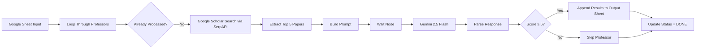

# AI Professor Finder

An automated n8n workflow that discovers and evaluates potential MSc/PhD supervisors using Google Scholar and Gemini AI.

The workflow reads professor information from Google Sheets, retrieves their recent publications via SerpAPI, compares their research against a student's thesis, and produces AI-generated compatibility scores and funding recommendations.

---

## Features

* Reads professor lists from Google Sheets

* Skips already processed rows

* Searches Google Scholar papers (2022–2026)

* Extracts recent publications using SerpAPI

* Uses Gemini 2.5 Flash for research similarity analysis

* Generates:

  * Relevance score (0–10)
  * Most relatable paper
  * Research overlap analysis
  * Funding potential estimate
  * Recommendation on whether to email
  * Personalized email talking points

* Saves results into an output spreadsheet

* Marks processed rows automatically

* Batch processing support

* Built-in delay to avoid rate limits

---

## Workflow



---

## Tech Stack

* n8n
* Google Sheets API
* SerpAPI
* Gemini 2.5 Flash
* JavaScript Code Nodes

---

## Input Spreadsheet

| Country | Name       | University            | Status |
| ------- | ---------- | --------------------- | ------ |
| Canada  | John Doe   | University of Alberta |        |
| USA     | Jane Smith | Purdue University     | DONE   |

Rows marked `DONE` are skipped automatically.

---

## Output Spreadsheet

| Country | Name     | University | Relevance | Funding Potential | Email Recommendation |
| ------- | -------- | ---------- | --------- | ----------------- | -------------------- |
| Canada  | John Doe | UAlberta   | 8         | High              | Strongly recommended |

---

## AI Analysis Includes

### RELEVANCE_SCORE

Research fit between professor publications and student's thesis.

### MOST_RELATABLE_PAPER

The publication most aligned with the student's work.

### RESEARCH_OVERLAP

Shared areas such as:

* LLM security
* Adversarial robustness
* Quantization
* Model compression
* Trustworthy AI
* Post-deployment defenses

### SHOULD_EMAIL

Recommendation level:

* Strongly recommended
* Recommended
* Maybe
* Probably not

### FUNDING_POTENTIAL

* High
* Medium
* Low

### EMAIL_TALKING_POINTS

Specific research topics to mention when contacting the professor.

---

## Environment Variables

```env
SERPAPI_API_KEY=
GEMINI_API_KEY=
GOOGLE_SHEETS_CREDENTIALS=
```

---

## Example Use Cases

* MSc supervisor search
* PhD supervisor discovery
* Research collaboration opportunities
* Funding opportunity analysis
* Automated literature-based professor matching

---

## Future Improvements

* Semantic similarity embeddings
* Arxiv paper integration
* Email generation automation
* Professor webpage scraping
* Citation analysis
* PDF paper summarization
* RAG-based memory
* Multi-LLM support (OpenAI, Claude, Gemini)

---

## Repository Structure

```
.
├── workflow.json
├── README.md
├── screenshots/
├── examples/
└── docs/
```

---

## License

MIT License

---

## Disclaimer

This project provides AI-assisted recommendations. Funding decisions and research compatibility should always be verified manually.

